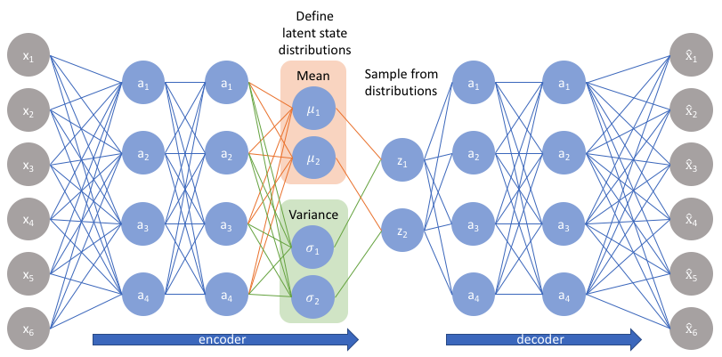
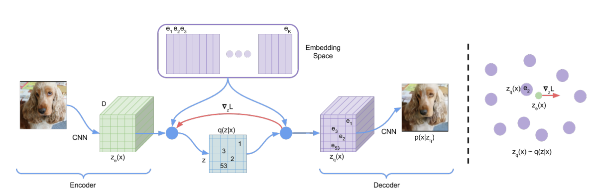
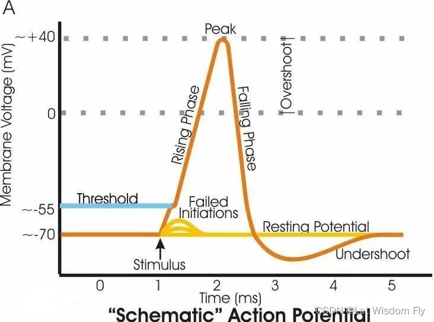
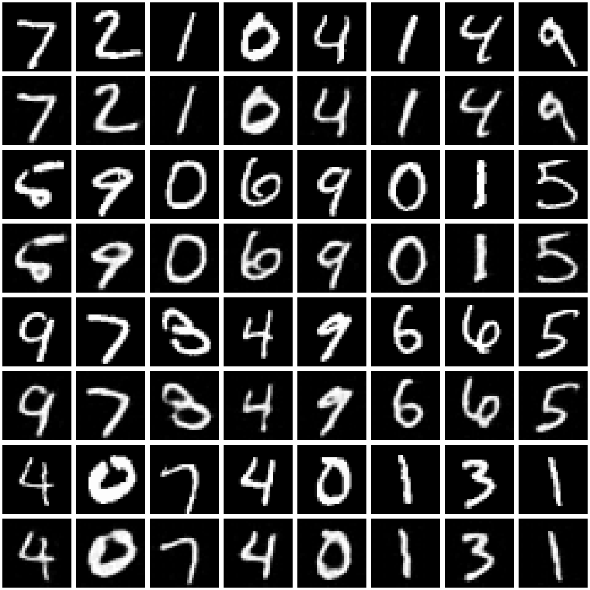
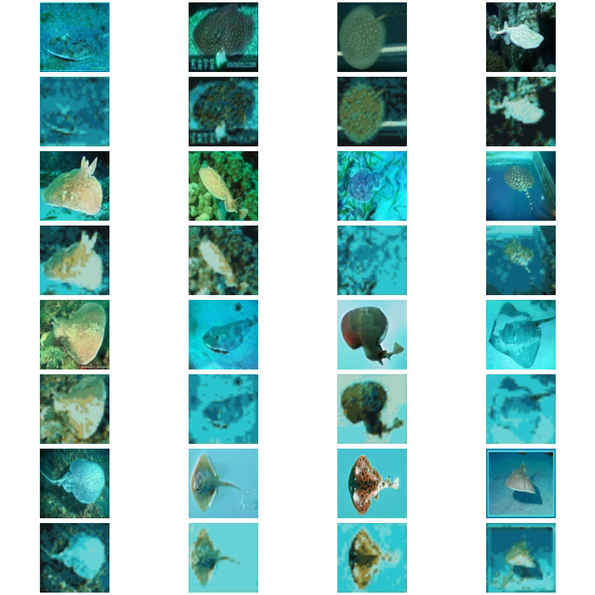
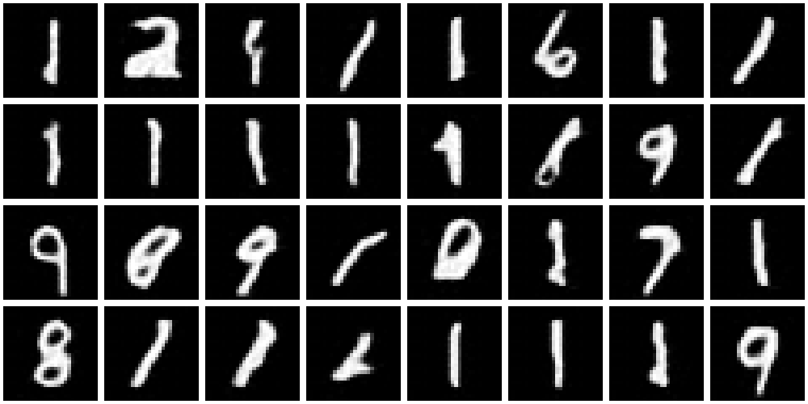
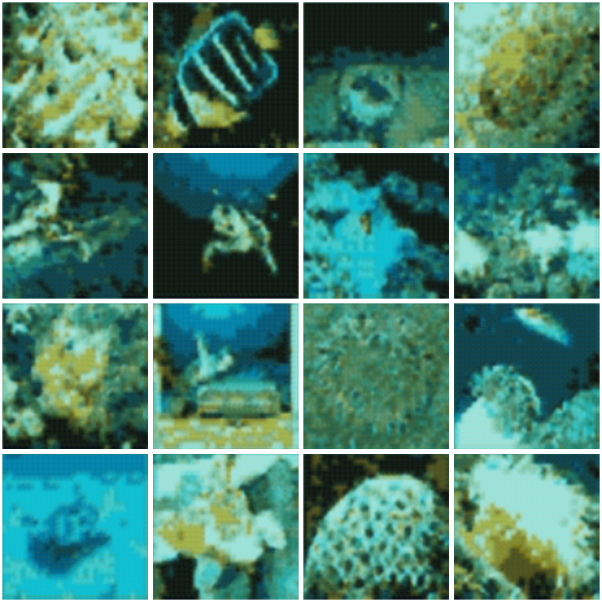

---

# 基于 SNN 的 VQ-SVAE 实现 State Diffusion
项目完成人：彭斌-第二十三组

## 目录
- [一、项目研究背景](#一项目研究背景)
- [二、基于SNN的矢量量化变分自编码器](#二基于snn的矢量量化变分自编码器)
   - [2.1.变分自编码器VAE](#21变分自编码器vae)
   - [2.2.矢量量化变分自编码器(VQ-VAE)](#22-矢量量化变分自编码器vq-vae)
   - [2.3.VQ-SVAE](#23-vq-svae)
      - [2.3.1 LIF 神经元模型](#231-lif-神经元模型)
      - [2.3.2. VQ-SVAE数学描述](#232-vq-svae数学描述)
- [三、与SNN兼容的State Diffusion](#三与snn兼容的state-diffusion)
   - [3.1. 过程简述](#31-过程简述)
   - [3.2. Absorbing State Diffusion数学描述](#32-absorbing-state-diffusion数学描述)
      - [3.2.1. 扩散转移过程](#321-扩散转移过程)
      - [3.2.2 吸收状态转移矩阵](#322-吸收状态转移矩阵)
      - [3.2.3. 反向去噪过程](#323-反向去噪过程)
      - [3.2.4. 损失优化](#324-损失优化)
      - [3.2.5. 降低训练随机性](#325-降低训练随机性)
- [四、实验结果展示](#四实验结果展示)
   - [4.1. VQ-SVAE重构结果](#41-vq-svae重构结果)
   - [4.2. IS指标评估](#42-is指标评估)
   - [4.3 Spiking Diffusion效果图](#43-spiking-diffusion效果图)
   - [4.4. 结果分析](#44-结果分析)
- [参考文献](#参考文献)
- [依赖](#依赖)
- [使用方法](#使用方法)


## 一、项目研究背景

随着深度学习的不断发展，生成模型在图像合成、增强及重建等任务中取得了显著的进展。然而，在水下图像处理场景中，由于复杂的环境光照、散射效应和模糊噪声，传统生成模型在水下图像质量提升方面表现有限。特别是 **变分自编码器 (VAE)** 在处理复杂自然场景时，往往存在生成样本质量不足的问题，例如模糊和细节丢失等。此外，水下图像增强需要有效的稀疏特征捕获和高效的模型优化策略，进一步增加了技术挑战。

脉冲神经网络 (SNN) 是一种受生物神经科学启发的模型，能够利用脉冲序列模拟离散事件的动态过程，非常适合捕获稀疏分布特征。然而，SNN 在生成连续数据时的表现较弱，尤其是处理连续图像生成任务时，难以直接建模分布中的复杂依赖关系。

为了解决这些问题，本文采用了一种基于 **VQ-SVAE (矢量量化稀疏变分自编码器)** 和 **吸收状态扩散 (Absorbing State Diffusion)** 的水下图像增强方法：
1. **VQ-SVAE** 通过矢量量化模块，将输入数据的连续分布离散化为稀疏状态矩阵，降低了水下噪声的干扰，并增强了对关键特征的捕获能力。
2. **吸收状态扩散机制** 定义了一个具有吸收状态的马尔可夫链，用于逐步将稀疏状态矩阵转化为可控噪声掩码，随后利用反向扩散恢复高质量图像，改善生成细节质量。

通过在 MNIST 和水下图像数据集上的测试，验证了模型的有效性，特别是在 **IS（Inception Score）** 指标下显著优于传统方法。这种方法为水下图像处理提供了一个结合生成模型和生物神经启发计算的创新框架。

## 二、基于SNN的矢量量化变分自编码器

### 2.1.变分自编码器(VAE)


**VAE** 是一种深度生成模型，它通过引入潜在变量 $ z $ 来生成数据。VAE 的目标是通过最大化证据下界（ELBO）来优化模型，使得模型能从潜在空间 $ p(z) $ 中生成与观测数据 $ x $ 类似的样本。


在 VAE 中，编码器网络将输入数据 $ x $ 映射到潜在空间的一个分布 $ q(z|x) $，解码器网络则从这个分布中采样，重构数据 $ \hat{x} = p(x|z) $。VAE 的损失函数包含两部分：
1. **重构误差**：确保模型能够准确地重建输入数据 $ x $。
2. **KL 散度**：确保潜在分布 $ q(z|x) $ 接近先验分布 $ p(z) $，通常是标准正态分布。

VAE 的潜在空间是连续的，因此其生成过程适用于连续数据（如图像、音频等）。

### 2.2. 矢量量化变分自编码器(VQ-VAE)

**矢量量化**（VQ）是一种离散化的方法，常用于将连续空间的值映射到有限的离散值集合中。在自然语言处理中，矢量量化用于将词嵌入离散化；在图像处理中，矢量量化可以将图像特征映射到离散的代码簿元素中。
VQ 的核心思想是，将连续空间中的点映射到一组离散的原子集合。每个数据点通过最接近的代码簿项进行替换，从而实现离散编码。


VQ-VAE 是由 **Aaron van den Oord** 等人于 2017 年提出的，其主要创新是结合了变分自编码器和矢量量化，使用离散的潜在空间来表示数据。与传统 VAE 不同，VQ-VAE 在潜在空间引入了离散的编码表示，而不是连续的潜在变量。

在传统的 VAE 模型中，生成过程通常依赖于 **高斯分布** 来近似数据的潜在空间。这使得 VAE 在一些复杂任务中，例如生成高质量的图像或处理高维数据时，存在一定的不足，特别是在图像质量和潜在空间的表示能力上。VQ-VAE 通过向量量化将潜在变量映射到离散的代码簿，从而提高了生成图像的精度和可控性。


VQ-VAE 由编码器（Encoder）、解码器（Decoder）和代码簿（Codebook）组成。

1. **编码器（Encoder）**：输入 $ x $ 经过编码器（通常是一个卷积神经网络），输出一个连续的潜在表示 $ z_e(x) $。
   
2. **量化（Quantization）**：将连续潜在表示 $ z_e(x) $ 替换为代码簿中最接近的离散向量。这个过程被称为“矢量量化”。对于每个位置的潜在变量，VQ-VAE 会找到最接近的代码簿向量，并将其作为离散潜在表示。
   
3. **代码簿（Codebook）**：VQ-VAE 使用一个固定大小的代码簿 $ E = \{e_1, e_2, \dots, e_K\} $ 来表示所有可能的离散潜在向量。每个潜在向量 $ z_e(x) $ 都会被映射到这个代码簿中的某个离散向量。

4. **解码器（Decoder）**：从离散潜在向量 $ z_q(x) $ 中生成重建图像 $ \hat{x} $，通过一个解码网络（通常是卷积神经网络）。这与传统的 VAE 类似，只不过解码器接受的是离散编码而不是连续潜在变量。

5. **损失函数**：
   - **重构误差**：与传统 VAE 一样，VQ-VAE 也会计算输入图像和重建图像之间的误差（例如，均方误差）。
   - **量化损失**：为了确保连续潜在向量 $ z_e(x) $ 被有效地量化，VQ-VAE 还引入了一个量化损失项，确保连续潜在向量与代码簿向量之间的距离最小化。这个损失项的形式为：
   
     $$
     L_{\text{vq}} = \| \text{sg}[z_e(x)] - z_q(x) \|^2 + \| z_e(x) - \text{sg}[z_q(x)] \|^2
     $$
     其中，$ \text{sg} $ 表示“停止梯度”操作，即不让梯度通过量化操作传递。第一项是标准的量化误差，第二项是为了避免潜在表示离代码簿向量过远。

### 2.3. VQ-SVAE

**VQ-SVAE（Vector Quantized Spiking Variational Autoencoder）** 是一种将 **VQ-VAE** 和 **SNN（脉冲神经网络）** 相结合的模型，旨在通过结合这两种技术的优势，克服传统自编码器在图像生成和建模任务中的一些局限性。VQ-SVAE 主要通过引入量化的潜在空间和脉冲神经网络的特性来增强模型在生成任务中的表现，尤其是在处理时序数据或需要模拟神经活动的任务中。

尽管 VQ-VAE 在图像生成中取得了显著的成功，但它主要依赖于标准的前馈神经网络来编码和解码数据，缺乏对时序和动态变化的建模能力。而在一些应用场景中，特别是处理动态时序数据（如生物信号、视频序列等）时，传统神经网络的表现可能不如 **脉冲神经网络（SNN）**。

#### 2.3.1. LIF 神经元模型

**LIF** 神经元模型用于脉冲的生成。该模型通过以下方程来描述：

1. **膜电位动态**：

   $$
   H[t] = V[t-1] + \frac{1}{\tau}(X[t] - (V[t-1] - V_{\text{reset}}))
   $$

   其中：
   - $ H[t] $ 表示神经元在时间 $ t $ 的膜电位（在发放脉冲之前）。
   - $ V[t-1] $ 表示前一个时间步的膜电位。
   - $ X[t] $ 表示时间步 $ t $ 的突触输入电流。
   - $ \tau $ 是膜时间常数。
   - $ V_{\text{reset}} $ 是神经元发放脉冲后的复位电位。

2. **脉冲生成条件**：

   $$
   S[t] = \Theta(H[t] - V_{\text{th}})
   $$

   其中：
   - $ S[t] $ 表示时间步 $ t $ 的脉冲生成（如果 $ H[t] \geq V_{\text{th}} $，则 $ S[t] = 1 $ 否则为 0）。
   - $ \Theta(v) $ 是 Heaviside 步进函数，当 $ v \geq 0 $ 时为 1，否则为 0。
   - $ V_{\text{th}} $ 是脉冲的阈值。

3. **脉冲后的膜电位复位**：

   $$
   V[t] = H[t](1 - S[t]) + V_{\text{reset}}S[t]
   $$

   其中：
   - $ V[t] $ 表示脉冲发放后的膜电位。
   - 如果没有发放脉冲（$ S[t] = 0 $），则膜电位保持为 $ H[t] $。
   - 如果发放脉冲（$ S[t] = 1 $），则膜电位复位为 $ V_{\text{reset}} $。

这些方程描述了 **LIF 神经元** 的行为，其中膜电位随时间变化，输入电流和神经元的状态决定了是否会发放脉冲。



VQ-SVAE 模型由两个主要部分组成：**VQ编码器** 和 **SNN编码器**。

#### 2.3.2. VQ-SVAE数学描述
**VQ-SVAE** 模型用于学习输入图像的离散潜在表示。模型的步骤如下：

1. **编码**：
   输入图像 $ x $ 首先通过 **SNN 编码器** 编码为脉冲序列 $ z_E $。通过 **脉冲发放率（SFR）** 和 **突触后电位（PSP）** 来建模脉冲序列：

   $$
   SFR(z_E) = \frac{1}{T_s} \sum_{t=1}^{T_s} z_E[t]
   $$

   $$
   PSP(z_E \leq t_s) = (1 - \frac{1}{\tau_{\text{syn}}}) \times PSP(z_E \leq t_s - 1) + \frac{1}{\tau_{\text{syn}}} \times z_E[t]
   $$

   其中：
   - $ T_s $ 是脉冲序列的长度。
   - $ \tau_{\text{syn}} $ 是突触时间常数。
   - $ PSP(z_E) $ 模拟了突触后神经元对脉冲序列的响应。

   ```
   class PSP(torch.nn.Module):
      def __init__(self):
         super().__init__()
         self.tau_s = 2

      def forward(self, inputs):
         """
         inputs: (T, N, C)
         """
         syns = None
         syn = 0
         n_steps = inputs.shape[0]
         
         for t in range(n_steps):
            syn = syn + (inputs[t,...] - syn) / self.tau_s
            if syns is None:
                  syns = syn.unsqueeze(0)
            else:
                  syns = torch.cat([syns, syn.unsqueeze(0)], dim=0)
            #print (syn.shape)
         return syns
   ```

2. **量化编码**：
   量化脉冲序列时使用一个代码本 $ Z $，通过最近邻搜索将每个空间特征映射到代码本中最接近的嵌入向量：

   $$
   h_0 = Q(z_E, Z) = \arg \min_k ||z_E[i,j] - z_k||_2
   $$

   $$
   z_Q = \text{Index}(Z, h_0)
   $$

   其中：
   - $ Q(z_E, Z) $ 通过查找最近的嵌入来量化脉冲序列。
   - $ z_Q $ 是量化后的潜在表示。

   ```
   class VectorQuantizer(nn.Module):
      def __init__(self, embedding_dim, num_embeddings, commitment_cost):
         super().__init__()
         self.embedding_dim = embedding_dim 
         self.num_embeddings = num_embeddings 
         self.commitment_cost = commitment_cost 
         self.memout = MembraneOutputLayer()
         self.num_step = 16
         self.psp = PSP()
         self.alpha = nn.Parameter(torch.tensor(0.5))
         #self.alpha=1
         self.embeddings = nn.Embedding(self.num_embeddings, self.embedding_dim)
         self.poisson = nn.Sequential(
            layer.Conv2d(in_channels=16, out_channels=16, kernel_size=1),
            layer.BatchNorm2d(16),
            neuron.LIFNode(surrogate_function=surrogate.ATan()),
         )

      def forward(self, x):
         # (T,N,C,H,W)->(N,C,H,W) 16 128 16 7 7
         x_memout = (1-self.alpha)*self.memout(x) + self.alpha*torch.sum(x,dim=0)/self.num_step
         # [128, 16, 7, 7] -> [128, 7, 7,16]
         x_memout = x_memout.permute(0, 2, 3, 1).contiguous()
         # [128, 7, 7,16] -> [6272, 16]
         flat_x = x_memout.reshape(-1, self.embedding_dim)
      
         encoding_indices = self.get_code_indices(flat_x)

         quantized = self.quantize(encoding_indices)
         quantized = quantized.view_as(x_memout) # [128, 7, 7, 16]
         
         if not self.training:
            quantized = quantized.permute(0, 3, 1, 2).contiguous() #[128, 16, 7, 7]
            quantized = torch.unsqueeze(quantized, dim=0) #[1, 128, 16, 7, 7]
            quantized = quantized.repeat(16, 1, 1, 1, 1) #[16, 128, 16, 7, 7]
            quantized = self.poisson(quantized) # [16, 128, 16, 7, 7]
            return quantized,encoding_indices


         # embedding loss: move the embeddings towards the encoder's output
         q_latent_loss = F.mse_loss(quantized, x_memout.detach())

         # commitment loss
         e_latent_loss = F.mse_loss(x_memout, quantized.detach())

         loss_1 = q_latent_loss + self.commitment_cost * e_latent_loss

         # Straight Through Estimator 
         # forward quantized = quantized
         # backward quantized = x
         quantized = x_memout + (quantized - x_memout).detach()
         # [128, 7, 7,16]->[128,16,7,7]
         quantized = quantized.permute(0, 3, 1, 2).contiguous()

         # FIXME:
         quantized = torch.unsqueeze(quantized, dim=0) # [1,128,16,7,7] 
         quantized = quantized.repeat(16, 1, 1, 1, 1) # [16,128,16,7,7]
         quantized = self.poisson(quantized) # [16,128,16,7,7]

         q_latent_loss_2 = torch.mean((self.psp(quantized)-self.psp(x.detach()))**2)
         e_latent_loss_2 = torch.mean((self.psp(quantized.detach())-self.psp(x))**2)
         loss_2 =  q_latent_loss_2 + self.commitment_cost * e_latent_loss_2
         
         return quantized, loss_1 +loss_2
   ```

3. **损失函数**：
   总体损失函数由重建误差、量化误差和 PSP 一致性项组成：

   $$
   L_{\text{VQ-SVAE}} = ||x - \hat{x}||^2 + ||z_E - z_Q||^2_2 + \sum_{t=1}^{T_s} ||PSP(\text{sg}[z_E \leq t_s]) - PSP(z_Q \leq t_s)||^2 + \beta \sum_{t=1}^{T_s} ||PSP(\text{sg}[z_Q \leq t_s]) - PSP(z_E \leq t_s)||^2
   $$

   其中：
   - $ \hat{x} $ 是重建的图像。
   - $ \text{sg}[·] $ 表示停止梯度操作。
   - $ \beta $ 是正则化超参数。

   ```
   class SNN_VQVAE(nn.Module):
      def __init__(self, in_dim, embedding_dim, num_embeddings, data_variance, 
         commitment_cost=0.25):
         super().__init__()
         self.in_dim = in_dim
         self.embedding_dim = embedding_dim
         self.num_embeddings = num_embeddings
         self.data_variance = data_variance
         
         self.encoder = Encoder(in_dim, embedding_dim)
         self.vq_layer = VectorQuantizer(embedding_dim, num_embeddings, commitment_cost)
         self.decoder = Decoder(in_dim, embedding_dim)
         self.memout = MembraneOutputLayer()

      def forward(self, x,image):
         # x: [t, B, C, H, W]
         z = self.encoder(x)
         # print(z.shape)
         if not self.training:
            e,enco = self.vq_layer(z)
            x_recon = self.decoder(e)
            x_recon = torch.tanh(self.memout(x_recon))
            return e, x_recon,enco
         
         e, e_q_loss = self.vq_layer(z)
         x_recon = self.decoder(e)
         x_recon = torch.tanh(self.memout(x_recon))
         
         real_recon_loss = F.mse_loss(x_recon, image)
         recon_loss = real_recon_loss / self.data_variance
         
         return e_q_loss,recon_loss,real_recon_loss
   ```

这个损失函数确保模型能够学习到有意义的离散表示，同时在量化过程中保留信息。

## 三、与SNN兼容的State Diffusion（Spiking Diffusion）

### 3.1. 过程简述
**Absorbing State Diffusion** 的主要目的是设计一个高效的扩散过程，将输入数据逐步转化为一个完全掩码化的状态（吸收状态），同时保留其结构信息，以便反向过程能够逐步去噪恢复原始数据。
这种方法特别适合于**离散生成模型**、**图像增强**（如水下图像复原）、以及与尖峰神经网络结合的应用场景。

1. **模拟离散数据的逐步破坏**
在吸收状态扩散中，数据通过多个时间步（扩散过程）逐步引入噪声，具体表现为将离散变量的每个值随机替换为 \([MASK]\)（吸收状态）。通过这种逐步破坏，模型可以学习如何从破坏后的数据中恢复原始分布。

2. **引入吸收状态简化计算**
吸收状态是一个固定状态（如 \([MASK]\)），当数据进入该状态后，将不再发生变化。在扩散过程中，所有数据最终都被吸收到固定状态，便于反向去噪。

3. **与SNN的兼容性**
尖峰神经网络擅长处理离散事件或稀疏数据。吸收状态扩散通过：
- 将数据状态限制在 \(K+1\) 个离散类别（原始类别 \(K\) + 吸收状态 \([MASK]\)）；
- 使用稀疏的转移矩阵 \(Q_{td}\)；
使得这一机制与尖峰神经网络完美契合，适用于稀疏神经信号的生成和处理。

### 3.2. Absorbing State Diffusion数学描述

通过 VQ-SVAE，输入训练数据集被编码为离散矩阵 \(h_0\)，其元素是离散随机变量，取值范围是 \(K\) 类。

#### 3.2.1. 扩散转移过程
扩散过程是一个马尔可夫链，描述了离散矩阵在扩散中的状态转移：
\[
q(h_{td} | h_{td-1}) = \text{Cat}(h_{td}; p = h_{td-1} Q_{td}),
\]
其中：
- \(\text{Cat}(h; p)\)：表示以概率 \(p\) 参数化的类别分布；
- \(Q_{td}\)：是前向马尔可夫链的转移矩阵，其定义如下。

#### 3.2.2 吸收状态转移矩阵
在每个时间步长 \(td\)，状态转移矩阵 \(Q_{td} \in \mathbb{R}^{(K+1) \times (K+1)}\) 被设计为：
\[
Q_{td} = 
\begin{bmatrix}
1 - \gamma_{td} & 0 & \cdots & \gamma_{td} \\
0 & 1 - \gamma_{td} & \cdots & \gamma_{td} \\
\vdots & \vdots & \ddots & \vdots \\
0 & 0 & \cdots & 1
\end{bmatrix},
\]
其中：
- \(\gamma_{td} = \frac{1}{T_d - td + 1}\)，表示每个常规标记被替换为 \([MASK]\) 的概率；
- \(1 - \gamma_{td}\)：表示当前标记保持不变的概率。

```
def q_sample(self, x_0, t):
   x_t, x_0_ignore = x_0.clone(), x_0.clone()
   t_mask = t.reshape(x_0.shape[0], 1, 1,1)
   t_mask = t_mask.expand(x_0.shape[0], 1, 7, 7) # 和x形状相同进行掩码    
   mask = torch.rand_like(x_t.float()) < (t_mask.float() / self.num_timesteps)

   # 将x_t中mask为1的位置替换为self.mask_id，这是一个特殊的标识符，表示该位置被掩码了。
   x_t[mask] = self.mask_id

   # 将x_0_ignore中mask为0的位置替换为-1，这是一个忽略索引，表示该位置不参与损失计算
   x_0_ignore[torch.bitwise_not(mask)] = -1
   return x_t, x_0_ignore, mask
```

通过吸收状态扩散，逐渐将所有离散矩阵元素替换为 \([MASK]\)（即吸收状态 \(K\)），最终所有元素在 \(T_d\) 步后都变为 \([MASK]\)。

#### 3.2.3. 反向去噪过程
反向过程由参数 \(\theta\) 定义的马尔可夫链建模，目标是从扩散后的分布逐步去噪恢复到原始数据分布：
\[
p_\theta(h_{0:T_d}) = p(h_{T_d}) \prod_{td=1}^{T_d} p_\theta(h_{td-1} | h_{td}).
\]

#### 3.2.4. 损失优化
通过证据下界（Evidence Lower Bound, ELBO）优化反向过程的参数 \(\theta\)，其每个时间步的损失定义为：
\[
L_{td} = D_{\text{KL}}(q(h_{td-1}|h_0) || p_\theta(h_{td-1}|h_{td})),
\]
其中：
- \(q(h_{td-1} | h_0)\)：真实扩散分布；
- \(p_\theta(h_{td-1} | h_{td})\)：模型预测分布；
- \(D_{\text{KL}}\)：KL 散度，用于衡量两者的距离。

#### 3.2.5. 降低训练随机性
引入 SDID \(S(h_{td}, td)\)，直接预测 \(p_\theta(h_0 | h_{td})\)，而非逐步学习 \(p_\theta(h_{td-1} | h_{td})\)。这样，变分边界可以简化为：
\[
\mathbb{E}_{q(h_0)} \left[ \sum_{td=1}^{T_d} \frac{1}{td} \mathbb{E}_{q(h_{td} | h_0)} \sum_{h_{td}(i, j) = m} \log p_\theta(h_0(i, j) | h_{td}) \right].
\]

```
def _train_loss(self, x_0):
   b, device = x_0.size(0), x_0.device
   t, pt = self.sample_time(b, device)
   x_t, x_0_ignore, mask = self.q_sample(x_0=x_0, t=t)
   x_0_hat_logits = self._denoise_fn(x_t, t=t)

   cross_entropy_loss = F.cross_entropy(x_0_hat_logits.reshape(b,self.num_classes,49), x_0_ignore.reshape(b,49).type(torch.LongTensor).to(device), 
   ignore_index=-1, reduction='none').sum(1)
   
   vb_loss = cross_entropy_loss / t
   vb_loss = vb_loss / pt
   vb_loss = vb_loss / (math.log(2) * x_0.shape[1:].numel())
```


## 四、实验结果展示

为了验证 **Spiking Diffusion** 的生成能力，我们分别在 **MNIST 数据集**（手写数字图像）和 **水下图像数据集**（复杂环境图像）上进行了实验，在实验结果的评估中，我们还引入了 **IS（Inception Score）** 作为生成图像质量的定量评估指标，以进一步验证方法的有效性。


本次实验在一台搭载 NVIDIA GeForce RTX 3060 GPU 的笔记本电脑上运行，实验时间约为 **60 小时**。硬件配置如下：
- **GPU**: NVIDIA GeForce RTX 3060，显存 6GB
- **CPU**: Intel i7-11th Gen
- **RAM**: 16GB DDR4
- **存储**: NVMe SSD 1T
- **操作系统**: Windows 11 


### 4.1. VQ-SVAE重构结果

1. **MINST数据集**
样本量：6000张手写数据
原图（上）和VQ-SVAE重构图（下）对比
 

2. **水下数据集**
样本量：1200张水下摄影图
原图（上）和VQ-SVAE重构图（下）对比
 


### 4.2. IS指标评估

IS（Inception Score）通过衡量生成图像的多样性和类判别性，广泛用于生成模型的评估。在本实验中，我们采用经过预训练的分类网络（如 Inception V3）来计算 IS 值。具体计算公式为：

\[
IS = \exp \left( \mathbb{E}_{x \sim p_g} \left[ D_{\text{KL}}(p(y|x) || p(y)) \right] \right)
\]

其中：
- \(p(y|x)\) 是分类器预测生成图像 \(x\) 属于类别 \(y\) 的概率分布。
- \(p(y)\) 是生成图像在所有类别上的边际分布。

### 4.3 Spiking Diffusion效果图

1. **手写字迹生成**
 

2. **水下环境生成**
 

#### **IS 指标对比**
| 方法                  | IS ↓  | 备注                         |
|-----------------------|---------|------------------------------|
| MNIST生成图像         | **2.20**  | 类别清晰，生成样本多样性高    |
| 水下复杂环境生成图像   | **1.36** | 类别清晰，但比手写的模糊，生成样本多样性高    |

### 4.4. 结果分析：
1. **原始图像**：由于水下图像质量低，颜色失真和模糊问题严重，导致分类器的预测结果不稳定，IS 值较低。
2. **VQ-SVAE 重构图像**：经过编码和解码后，图像的结构和细节得以增强，分类器对类别的预测更清晰
3. **吸收状态扩散生成图像**：生成结果显著提升了图像的多样性，同时保留了类别信息的判别性，最终 IS 值达到 **2.20、1.36**，显示出更高的图像质量和生成能力。


## 参考文献
[1] Amirhossein Tavanaei, Masoud Ghodrati, Saeed Reza Kheradpisheh, Timothée Masquelier, and Anthony Maida, “Deep learning in spiking neural networks,” Neural networks, vol. 111, pp. 47–63, 2019.
[2] Friedemann Zenke and Surya Ganguli, “Superspike: Supervised learning in multilayer spiking neural networks,” Neural computation, vol. 30, no. 6, pp. 1514–1541, 2018.
[3] M. Liu, J. Gan, R. Wen, T. Li, Y. Chen和H. Chen, 《Spiking-Diffusion: Vector Quantized Discrete Diffusion Model with Spiking Neural Networks》, 2023年9月22日, arXiv: arXiv:2308.10187. doi: 10.48550/arXiv.2308.10187.

## 依赖
本项目需要以下 Python 库：
- `torch 1.6`（PyTorch cuda版）
- `spikingjelly` （SNN库）
- `matplotlib`（用于可视化）

## 使用方法
需要输入正确的数据集路径

要在 **MNIST** 数据集上训练请运行：
python -u main.py --dataset_name MNIST --model snn-vq-vae  
要在 **MNIST** 数据集上验证请运行：
python -u main.py --dataset_name MNIST --model snn-vq-vae --checkpoint XXXXXXXX/result/MNIST/snn-vq-vae/model.pth


要在 **WATER** 数据集上训练请运行：
python -u main.py --dataset_name WATER --model snn-vq-vae  
要在 **WATER** 数据集上验证请运行：
python -u main.py --dataset_name WATER --model snn-vq-vae --checkpoint XXXXXXXX/result/WATER/snn-vq-vae/model.pth
